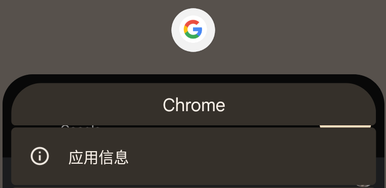
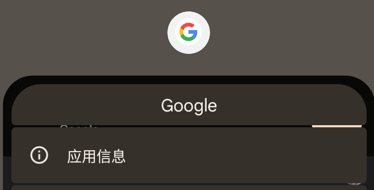
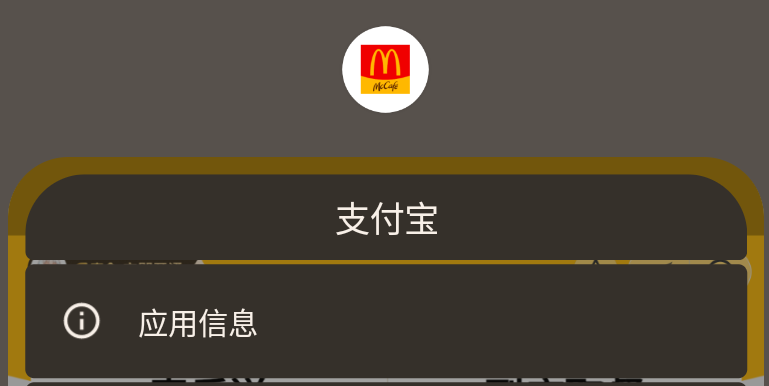
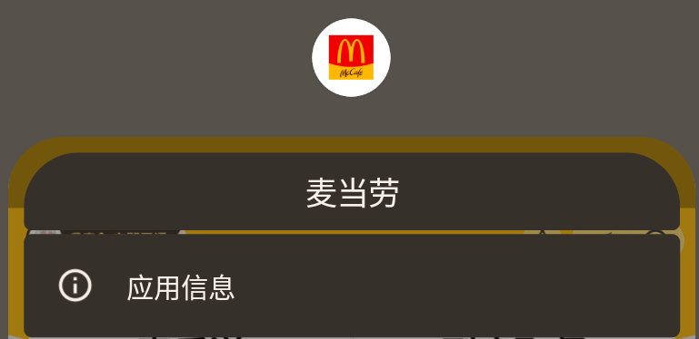

# TaskLabelAsTaskTitle

use `taskDescription.label` as task title in recent task list

like for `Chrome Custom Tabs` and `Alipay Mini Program`, the task title is the page title, not the app name

| before                      | after                     |
|-----------------------------|---------------------------|
|  |  |
|  |  |

## Download

release https://github.com/Xposed-Modules-Repo/io.github.duzhaokun123.tasklabelastasktitle

## Thanks

[AOSP](https://source.android.com/)

[EzXHelper](https://github.com/KyuubiRan/EzXHelper)

[xposed](https://forum.xda-developers.com/xposed)